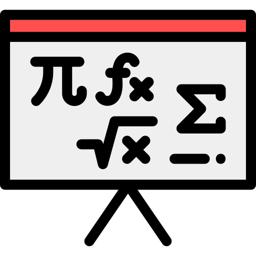
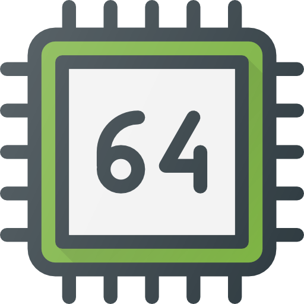

# Unipi-Projects

### Welcome to my University  Account.

 **University Of Piraus**

### Roadmap 

* **1st Year** 
  * First Semester
    1)  Ανάλυση I  :heavy_check_mark:
    2)  Αρχές Προγραμματισμού [C++]  :heavy_check_mark:
    3)  Εισαγωγή στην Επιστήμη των Υπολογιστών [Python]   :heavy_check_mark:
    4)  Λογική Σχεδίαση  ❌
    5)  Μαθηματικά Υπολογιστών    :heavy_check_mark:
    6)  Τεχνολογίες Διαδικτύου [HTML/CSS/JS/PHP]   :heavy_check_mark:

  * Sedond Semester
    1)  Ανάλυση II  ❌
    2)  Αντικειμενοστρεφής Προγραμματισμός [Java]   :heavy_check_mark:
    3)  Διακριτά Μαθηματικά   :heavy_check_mark:
    4)  Δομές Δεδομένων [C++]  ❌
    5)  Εφαρμοσμένη Άλγεβρα  ❌
    6)  Αρχιτεκτονική Υπολογιστών [Assembly]  ❌

* **2nd Year** 
  * Third Semester
    1)  Αντικειμενοστρεφής Ανάπτυξη Εφαρμογών [C# .Net Framework]   :heavy_check_mark:
    2)  Λειτουργικά Συστήματα [C/Bash]   :heavy_check_mark:
    3)  Μαθηματικός Προγραμματισμός  ❌
    4)  Μεταγλωττιστές [C/C++]   :heavy_check_mark:
    5)  Πιθανότητες και Στατιστική   :heavy_check_mark:
    6)  Εφαρμογές Θεωρίας Γραφημάτων  :heavy_check_mark:

  * Fourth Semester
    1)  Αλγόριθμοι [C++]  ❓
    2)  Αρχές και Εφαρμογές Σημάτων και Συστημάτων [Matlab]  ❓
    3)  Βάσεις Δεδομένων [SQL] ❓
    4)  Δίκτυα Υπολογιστών  ❓
    5)  Προγραμματισμός στο Διαδίκτυο και τον Παγκόσμιο Ιστό [Java]  ❓
    6)  Πληροφορική στην Εκπαίδευση  ❓

* **3d Year** 
  * Fifth Semester
    1) Αλληλεπίδραση Ανθρώπου και Υπολογιστή [C#]
    2) Αναγνώριση Προτύπων
    3) Πληροφοριακά Συστήματα [UML]
    4) Επιστημονική Συγγραφή στην Εκπαίδευση
    5) Συστήματα Διαχείρισης Βάσεων Δεδομένων [SQL]
    6) Λογικός Προγραμματισμός [Prolog]
  
  * Sixth Semester
    1) Τεχνητή Νοημοσύνη και Έμπειρα Συστήματα
    2) Τεχνολογία Λογισμικού [UML]
    3) Βιοπληροφορική
    4) Επεξεργασία Φυσικής Γλώσσας
    5) Συστήματα Πολυμέσων
    6) Ευφυής Αλληλεπίδραση με Κοινωνικά Δίκτυα

* **4th Year** 
  * Seventh Semester
    1) Εικονική Πραγματικότητα [C#]
    2) Ανάλυση Εικόνας
    3) Σύγχρονα Θέματα Τεχνολογίας Λογισμικού [Java]

  * Eighth Semester
  
  
***
### [Extras](https://github.com/unipi-projects/extras/blob/main/README.md)
